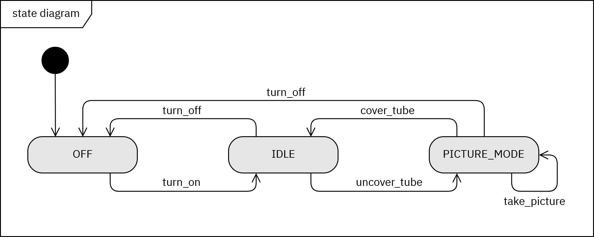

# XRay State Machine

## Builing

Clone the Git-repository (HTTPS)
```
git clone https://github.com/hendrikboeck/XRay_State_Machine.git
```
Open folder `cpp` inside the commandline
```
cd XRay_State_Machine/cpp
```
Make project
```
make all
```


## Overview

This Projects tries to emulate a very simplified version of a X-ray machine. The Software Engineering Pattern State is used for programming this machine.

### State diagram



### Class diagram


