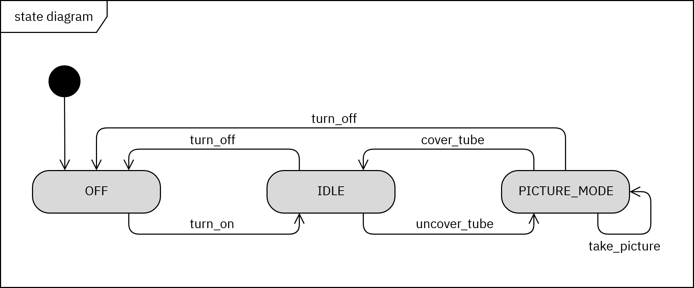
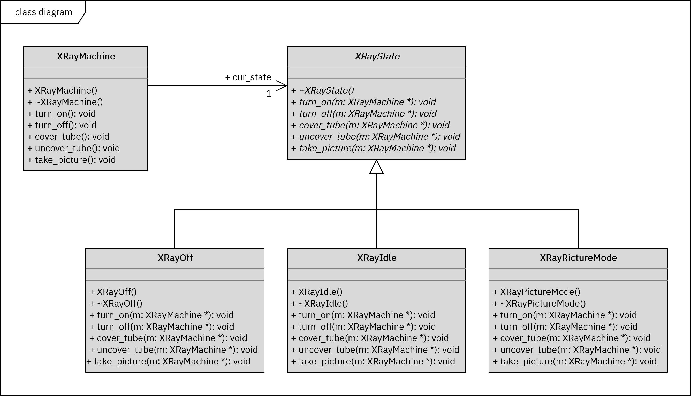

# X-ray State Machine

## Building and Running Applications

### Building C++ CLI-Application

```bash
git clone https://github.com/hendrikboeck/XRay_State_Machine.git
cd XRay_State_Machine/cpp
mkdir build && cd build
cmake ..
make all
```

### Building C CLI-Application

```bash
git clone https://github.com/hendrikboeck/XRay_State_Machine.git
cd XRay_State_Machine/c
mkdir build && cd build
cmake ..
make all
```

### Running Python3 CLI-Application

```bash
git clone https://github.com/hendrikboeck/XRay_State_Machine.git
cd XRay_State_Machine/python3/src
python3 unittest.py
```

### Runnning P5.js Graphical-Application

Repository von Github klonen oder als .zip herunterladen.
```bash
git clone https://github.com/hendrikboeck/XRay_State_Machine.git
mkdir XRay_State_Machine/p5/lib && cd XRay_State_Machine/p5/lib
wget https://github.com/processing/p5.js/releases/download/1.1.9/p5.js
```
In den Ordner `p5` navigieren und die Datei `index.html` mit ihrem Webbrowser aufrufen.

## Overview

This Projects tries to emulate a very simplified version of a X-ray machine. The Software Engineering Pattern State is used for programming this machine.

### State diagram



### Class diagram


